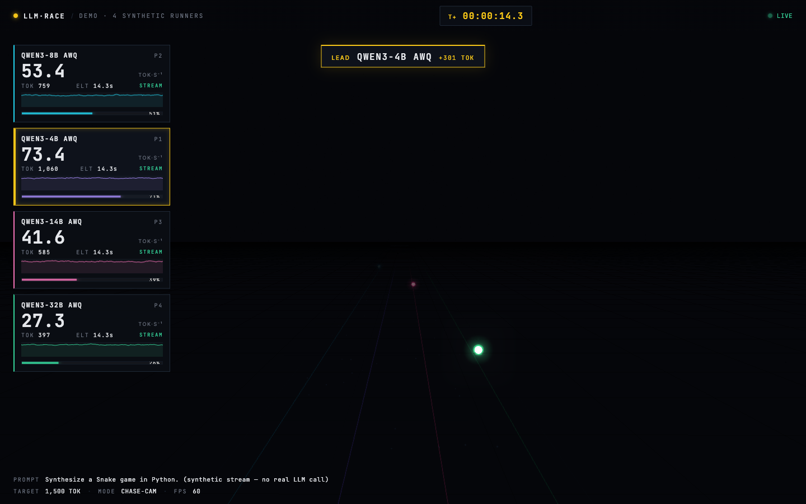

# llm-race

> Watch local LLMs race each other. The comparison **is the game.**

Any number of locally-running LLMs compete on the same prompt. Each model is
a runner on its own lane. Tokens streaming in push the runner forward. First
model to finish the prompt crosses the finish line.

**v0.3** (current) ships a Three.js + FastAPI WebSocket browser UI styled as
a SpaceX Stage-2 telemetry overlay — emissive energy orbs racing on a data
conduit, T+ clock, per-runner sparklines, leader callout. Runs in any modern
browser, no npm step.



Plug-and-play with anything that exposes an OpenAI-compatible
`/v1/chat/completions` endpoint:

- **vLLM**
- **llama.cpp** server
- **Ollama**
- **LM Studio**
- **SGLang**
- **MLX-server**
- anything else with the same shape

---

## Demo

`recordings/` is auto-populated with an MP4 + thumbnail at the end of each
race. Drop the file straight on Twitter / r/LocalLLaMA.

---

## Install

```bash
git clone https://github.com/drawais/llm-race
cd llm-race
pip install -e .
# OR run without installing:
uvx --from . llm-race run configs/example.yaml
```

---

## Run

1. Start one or more local LLM servers, each on a different port. Example
   with vLLM:

   ```bash
   vllm serve drawais/Qwen2.5-Coder-32B-Instruct-AWQ-INT4 --port 8001
   vllm serve drawais/Qwen2.5-Coder-32B-Instruct-HQQ-INT4 --port 8002
   ```

2. Edit `configs/example.yaml` to point at those endpoints (`base_url` +
   `model`).

3. Race:

   ```bash
   llm-race run configs/awq-vs-hqq.yaml
   ```

A pyxel game window pops up. Each LLM is a runner on its own lane.
Reasoning models (DeepSeek-R1-Distill, QwQ) visibly **stop and think**
during `<think>` blocks — the race teaches you that *tokens-to-completion*
matters more than raw `tok/s`.

---

## Config

```yaml
title: "build me Tetris in Python"
prompt: |
  Implement a complete, single-file pure-Python Tetris using pygame.
  Output ONLY the full code, no commentary.

runners:
  - id: model-a
    label: "Model A"            # shown next to the sprite
    base_url: http://localhost:8001/v1
    model: drawais/SomeModel-AWQ-INT4
    api_key: sk-no-key          # most local servers don't check
    extra_headers: {}           # for HF Inference Endpoints, etc.

  - id: model-b
    label: "Model B"
    base_url: http://localhost:8002/v1
    model: drawais/AnotherModel-HQQ-INT4
```

Add as many runners as your screen has lanes. The arena auto-stacks.

---

## How it works

1. `OpenAICompatRunner` connects to each endpoint via `AsyncOpenAI`,
   streams the response, counts tokens locally from `delta.content`, and
   emits `RaceEvent`s.
2. `Orchestrator` runs all runners concurrently in a background asyncio
   thread, feeding events into a thread-safe queue.
3. `Arena` (pyxel game) pulls events from the queue at 60 fps and animates
   each lane's sprite based on token progress.
4. `<think>...</think>` content makes a runner "think" instead of run —
   the bubble animation makes reasoning visible.
5. `FINISH` event triggers confetti + a winner banner.

---

## Roadmap (the repo grows by *contribution*, not by one-off ships)

- [x] **v0.1** — Lane-runner game, OpenAI-compat client, YAML config
- [ ] **v0.2** — Auto-record MP4 + GIF (cv2.VideoWriter or pyxel capture)
- [ ] **v0.3** — Code-quality grader (does the output compile? launch? finish a unit test?)
- [ ] **v0.4** — Side-by-side game-running viewer (run the LLM-generated
      code right next to the race)
- [ ] **v0.5** — Web UI fallback (NiceGUI → browser)
- [ ] **v0.6** — Pluggable game tracks (mario-kart, marble-race, horse-race themes)
- [ ] **v0.7** — Live leaderboard URL (post your race + see the global ranking)

---

## Contributing

Fork-friendly by design:

- Per-server quirks live in `llm_race/runners/quirks/<server>.py`.
- New visual themes live in `llm_race/game/<theme>.py` — the orchestrator
  is decoupled from rendering.
- Drop a YAML in `configs/` to add a new pre-canned race.

PRs welcome — see `CONTRIBUTING.md` (TBD).

## License

Apache 2.0. See [`LICENSE`](LICENSE).
